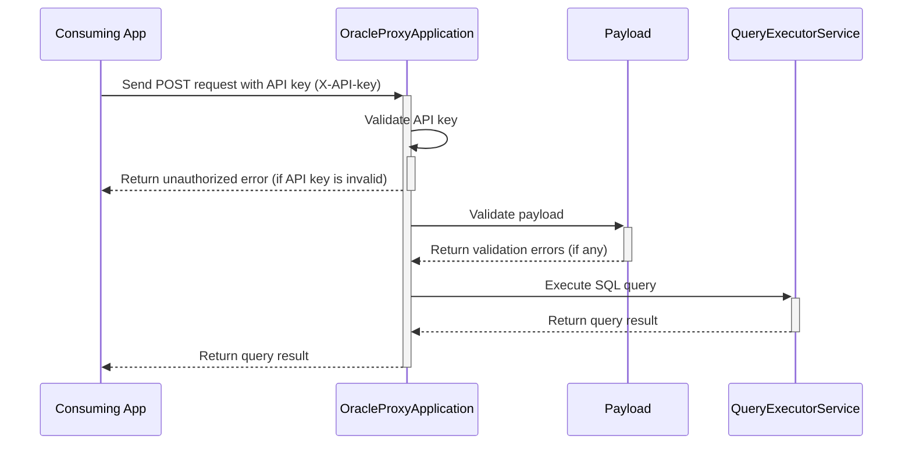

# nr-oracle-service

A Helm Chart to deploy a Quarkus API to do CRUD against Oracle DB over encrypted listeners.

Prerequisites:

- OpenShift namespace in bcgov tenant
- Oracle DB Host
- Oracle DB Port
- Oracle DB Name
- Oracle DB User
- Oracle DB Password
- Oracle DB HOST is reachable over encrypted connection from the OpenShift namespace

## Why

- To provide a consistent and simple way { API(http post endpoint) } to do CRUD against Oracle DB over encrypted listeners.
- Teams DO NOT need to learn java, manage certificates to do CRUD against Oracle DB over encrypted listeners.
- Use Node or Go or Python or any other language to do CRUD against Oracle DB over encrypted listeners via this http
  API deployed as proxy in the same namespace.

## How

- It is a single helm command to deploy to an openshift namespace.
- Can deploy multiple instances of this API to the same namespace with different names for different Oracle PROXY
  accounts.
- The API is secured with API Key.
- The API is never exposed to internet through routes and is only available for apps to consume within the same
  namespace.
- For Read queries, the POST payload looks like `{
  "queryType": "READ",
  "sql": "SELECT * from table_name"
  }`, the read query is executed against Oracle DB and the result is returned as JSON. The Query is executed in a
  readonly context [look here](./src/main/java/ca/bc/gov/nrs/api/service/QueryExecutorService.java#L37).
- For mutation(Insert,Update,Delete) queries, the POST payload looks like `{
  "queryType": "MUTATE",
  "sql": "INSERT INTO ... "
  }`. This is done in a transaction context and the data is committed to DB and if commit success then 200 Ok response
  is sent. [look here](./src/main/java/ca/bc/gov/nrs/api/service/QueryExecutorService.java#L67).

## Sequence flow


## Development

This project uses Quarkus, the Supersonic Subatomic Java Framework.

If you want to learn more about Quarkus, please visit its website: https://quarkus.io/ .

## Running the application in dev mode

You can run your application in dev mode that enables live coding using:

```shell script
./mvnw compile quarkus:dev
```

> **_NOTE:_**  Quarkus now ships with a Dev UI, which is available in dev mode only at http://localhost:8080/q/dev/.

## Packaging and running the application

The application can be packaged using:

```shell script
./mvnw package
```

It produces the `quarkus-run.jar` file in the `target/quarkus-app/` directory.
Be aware that it’s not an _über-jar_ as the dependencies are copied into the `target/quarkus-app/lib/` directory.

The application is now runnable using `java -jar target/quarkus-app/quarkus-run.jar`.

If you want to build an _über-jar_, execute the following command:

```shell script
./mvnw package -Dquarkus.package.type=uber-jar
```

The application, packaged as an _über-jar_, is now runnable using `java -jar target/*-runner.jar`.

## Creating a native executable

You can create a native executable using:

```shell script
./mvnw package -Pnative
```

Or, if you don't have GraalVM installed, you can run the native executable build in a container using:

```shell script
./mvnw package -Pnative -Dquarkus.native.container-build=true
```

You can then execute your native executable with: `./target/nr-oracle-service-1.0.0-SNAPSHOT-runner`

If you want to learn more about building native executables, please consult https://quarkus.io/guides/maven-tooling.

## Related Guides

- RESTEasy Classic ([guide](https://quarkus.io/guides/resteasy)): REST endpoint framework implementing Jakarta REST and
  more
- Agroal - Database connection pool ([guide](https://quarkus.io/guides/datasource)): Pool JDBC database connections (
  included in Hibernate ORM)
- JDBC Driver - Oracle ([guide](https://quarkus.io/guides/datasource)): Connect to the Oracle database via JDBC

## Provided Code

### RESTEasy JAX-RS

Easily start your RESTful Web Services

[Related guide section...](https://quarkus.io/guides/getting-started#the-jax-rs-resources)
