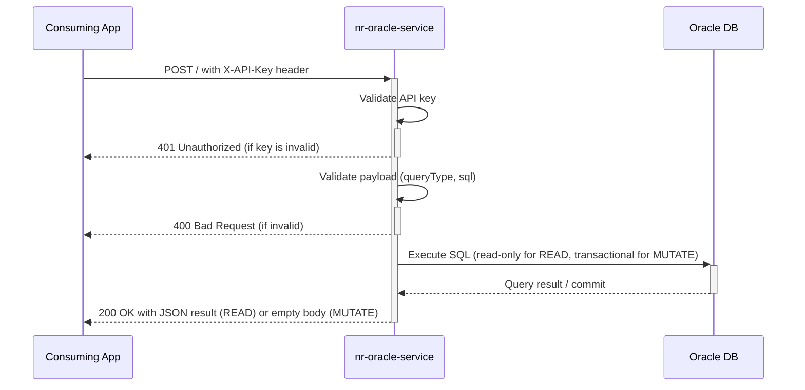

# nr-oracle-service

A small Quarkus API that lets any app in the same OpenShift namespace run CRUD SQL
against an Oracle DB over an encrypted (TCPS) connection, via a single authenticated
HTTP POST — no Java, JDBC driver, or certificate handling required on the caller's side.

## Contents

- [Why this exists](#why-this-exists)
- [How it works](#how-it-works)
- [Request flow](#request-flow)
- [Quick start: calling the API](#quick-start-calling-the-api)
- [Deploying with Helm](#deploying-with-helm)
- [Configuration](#configuration)
- [Local development](#local-development)
  - [Run in dev mode](#run-in-dev-mode)
  - [Package and run](#package-and-run)
  - [Build a native executable](#build-a-native-executable)
- [CI/CD](#cicd)
- [Project layout](#project-layout)
- [Related guides](#related-guides)

## Why this exists

- Gives teams one consistent way — a single `POST` endpoint — to do CRUD against
  Oracle DB over an encrypted listener.
- Consuming apps don't need to know Java, manage JDBC drivers, or handle TLS
  certificates/trust stores for the Oracle connection.
- Any language (Node, Go, Python, ...) can talk to Oracle DB through this HTTP API,
  deployed as a sidecar-style proxy in the same namespace.

## How it works

- Deployed with a single Helm command; the chart is published at
  `https://bcgov.github.io/nr-oracle-service`.
- You can deploy multiple instances into the same namespace, each pointed at a
  different Oracle proxy account, distinguished by Helm release name.
- Every request is authenticated with an `X-API-Key` header. The key is generated
  and stored in a Kubernetes Secret by the chart (see [Configuration](#configuration)).
- The service is never exposed outside the cluster — no Route is created. Only
  workloads inside the same namespace can reach it.
- An init container (`Dockerfile.certs`, image `nr-oracle-service-init`) fetches the
  Oracle DB's TLS certificate on every pod start via `get_certs.sh` and writes it to a
  shared `jssecacerts` trust store, mounted by the main container at `/app/cert`.
- **Read queries** — `queryType: "READ"` — run in a read-only transaction via
  [`QueryExecutorService.executeQuery`](./src/main/java/ca/bc/gov/nrs/api/service/QueryExecutorService.java#L34)
  and return the result set as JSON.
- **Mutations** (`INSERT`/`UPDATE`/`DELETE`) — `queryType: "MUTATE"` — run in a
  transaction via
  [`QueryExecutorService.mutateState`](./src/main/java/ca/bc/gov/nrs/api/service/QueryExecutorService.java#L64)
  and commit on success, returning `200 OK`.
- `GET /health` reports pod liveness/readiness by validating the DB connection pool
  (see [`Application.healthCheck`](./src/main/java/ca/bc/gov/nrs/api/Application.java#L29)).

## Request flow


```mermaid
sequenceDiagram
    participant Consuming App
    participant nr-oracle-service
    participant Oracle DB
    Consuming App ->>+ nr-oracle-service: POST / with X-API-Key header
    nr-oracle-service ->>+ nr-oracle-service: Validate API key
    nr-oracle-service -->>- Consuming App: 401 Unauthorized (if key is invalid)
    nr-oracle-service ->>+ nr-oracle-service: Validate payload (queryType, sql)
    nr-oracle-service -->>- Consuming App: 400 Bad Request (if invalid)
    nr-oracle-service ->>+ Oracle DB: Execute SQL (read-only for READ, transactional for MUTATE)
    Oracle DB -->>- nr-oracle-service: Query result / commit
    nr-oracle-service -->>- Consuming App: 200 OK with JSON result (READ) or empty body (MUTATE)
```

## Quick start: calling the API

Once deployed, send a `POST` to the service with your API key and a SQL payload.

Read query:

```http
POST http://nr-oracle-service.<namespace>.svc.cluster.local
Content-Type: application/json
X-API-Key: <your-api-key>

{
  "queryType": "READ",
  "sql": "SELECT * FROM my_schema.my_table"
}
```

Mutation:

```http
POST http://nr-oracle-service.<namespace>.svc.cluster.local
Content-Type: application/json
X-API-Key: <your-api-key>

{
  "queryType": "MUTATE",
  "sql": "INSERT INTO my_schema.my_table (id, name) VALUES (1, 'example')"
}
```


The OpenAPI/Swagger UI is available at `/q/swagger-ui` when the service is running.

## Deploying with Helm

Prerequisites:

- An OpenShift namespace in the bcgov tenant
- Oracle DB host, port, name, user, and password
- The Oracle DB host must be reachable over an encrypted connection from that namespace

```shell
helm repo add nr-oracle-service https://bcgov.github.io/nr-oracle-service
helm install my-release nr-oracle-service/nr-oracle-service \
  --set-string app.envs.DB_HOST=<db-host> \
  --set-string app.envs.DB_NAME=<db-name> \
  --set-string app.envs.DB_USER=<db-user> \
  --set-string app.envs.DB_PASSWORD=<db-password>
```

The chart generates and stores the API key and cert-store password as a Secret on
first install and reuses them on upgrade — see
[`charts/nr-oracle-service/templates/secret.yaml`](./charts/nr-oracle-service/templates/secret.yaml).
Full parameter reference: [charts/nr-oracle-service/README.md](./charts/nr-oracle-service/README.md).

> **Note:** the deployment template currently hardcodes the Oracle listener port to
> `1543` regardless of `app.envs.DB_PORT` — see
> [`templates/deployment.yaml`](./charts/nr-oracle-service/templates/deployment.yaml).
> Setting `DB_PORT` has no effect until that's templated properly.

## Configuration

Environment variables consumed by the app (set via Helm values under `app.envs.*` —
see the [chart README](./charts/nr-oracle-service/README.md) for the full table):

| Variable                       | Purpose                                       | Default |
|---------------------------------|------------------------------------------------|---------|
| `DB_HOST` / `DB_PORT` / `DB_NAME` | Oracle DB connection target                   | —       |
| `DB_USER` / `DB_PASSWORD`       | Oracle DB credentials                          | —       |
| `CERT_SECRET`                   | Password protecting the generated trust store  | —       |
| `API_KEY`                       | Required value of the `X-API-Key` header       | —       |
| `HTTP_PORT`                     | Port the service listens on                    | `3000`  |
| `POOL_MIN_SIZE` / `POOL_MAX_SIZE` / `POOL_INITIAL_SIZE` | JDBC connection pool sizing | `1`     |
| `POOL_MAX_LIFETIME`             | Max lifetime (ms) of a pooled connection       | `180000`|
| `POOL_IDLE_TIMEOUT`             | Idle removal interval (ms)                     | `60000` |
| `POOL_LEAK_DETECTION_INTERVAL`  | Connection leak detection interval (ms)        | `45000` |
| `ACCESS_LOG_ENABLED`            | Enable HTTP access logging                     | `false` |

## Local development

This project uses [Quarkus](https://quarkus.io/), the Supersonic Subatomic Java Framework,
targeting JDK 25.

### Run in dev mode

```shell
./mvnw compile quarkus:dev
```

> Quarkus ships with a Dev UI, available in dev mode only, at http://localhost:8080/q/dev/.

In dev mode the datasource connects directly to `${DB_HOST}:1521/${DB_NAME}` without TLS
(see the `%dev.quarkus.datasource.jdbc.url` override in
[`application.properties`](./src/main/resources/application.properties)), so point
`DB_HOST`/`DB_NAME`/`DB_USER`/`DB_PASSWORD`/`API_KEY` at a reachable dev database.

### Package and run

```shell
./mvnw package
```

This produces `target/quarkus-app/quarkus-run.jar` (not an über-jar — dependencies live in
`target/quarkus-app/lib/`). Run it with:

```shell
java -jar target/quarkus-app/quarkus-run.jar
```

For an über-jar instead:

```shell
./mvnw package -Dquarkus.package.type=uber-jar
java -jar target/*-runner.jar
```

### Build a native executable

```shell
./mvnw package -Pnative
```

Or, without a local GraalVM install, build inside a container:

```shell
./mvnw package -Pnative -Dquarkus.native.container-build=true
```

Run it with `./target/nr-oracle-service-<version>-runner`. See the
[Quarkus native executable guide](https://quarkus.io/guides/maven-tooling) for details.

The production [`Dockerfile`](./Dockerfile) builds a native image and additionally patches
the JDK's `java.security` at build time to re-enable legacy TLS algorithms, needed to
complete a handshake with a legacy 1024-bit RSA certificate on one target Oracle host. That
patch has to happen pre-compile because GraalVM native-image bakes JDK security providers
into the binary.

## CI/CD

- **PRs** ([`.github/workflows/pr-open.yml`](./.github/workflows/pr-open.yml)) build both
  container images (app + init) and deploy an ephemeral Helm release into the OpenShift
  dev namespace for review; [`pr-close.yml`](./.github/workflows/pr-close.yml) tears it down.
- **Merges to `main`** ([`.github/workflows/merge.yml`](./.github/workflows/merge.yml)) cut a
  semantic-versioned release, publish both images to GHCR, and publish/release the Helm chart
  to the `https://bcgov.github.io/nr-oracle-service` repo via chart-releaser.
- **Dependabot** ([`.github/dependabot.yml`](./.github/dependabot.yml)) tracks GitHub Actions
  and Maven dependencies weekly; minor/patch Maven bumps are grouped into one PR, majors get
  individual review.

## Project layout

```
src/main/java/ca/bc/gov/nrs/api/
├── Application.java                 # REST endpoints: POST /, GET /health
├── service/QueryExecutorService.java# Read/mutate SQL execution against Oracle
└── structs/                         # Payload + QueryType request model
charts/nr-oracle-service/            # Helm chart (Deployment, Secret, PVC, HPA, NetworkPolicy...)
Dockerfile                           # Native build of the main API image
Dockerfile.certs / get_certs.sh      # Init-container image that fetches the DB's TLS cert
```

## Related guides

- [RESTEasy](https://quarkus.io/guides/resteasy) — REST endpoint framework (Jakarta REST)
- [Agroal](https://quarkus.io/guides/datasource) — JDBC connection pooling (used by Hibernate ORM too)
- [Oracle JDBC driver](https://quarkus.io/guides/datasource) — Oracle DB connectivity
